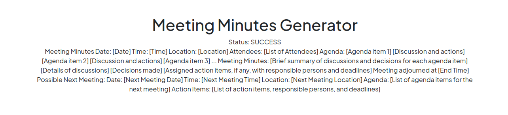

# LLM-Minutes-of-Meeting

The primary objective of this project is to showcase NLP & LLM's capability to quickly summarize long meetings and help you and your organization auto mate the task of delegating Minutes of Meeting(MoM) emails. It uses a high level 2 step approach where step 1 corresponds to convert any audio/video file into a text piece. Step 2 corresponds to using text produce by step 1 and generate Minutes of meeting. These minutes of meeting will be editable piece of text. Once you finalize the MoM, you can use it further as per your requirement. 

However, long term objective for this repository is also to develop a real time python web-application which can attend meetings for you and also provide you MoM at the end of the meeting. Taking baby steps and trying to get to long-term by starting a short term objective.

## Features:
Effortlessly convert audio and video files to accurate text transcripts: These can also be used to summarize, generate action items, understanding work-flows, and resource planning. 

Keyword highlighting and topic tagging for quick reference: Extracting topics and finding relevant contents to skip through meetings and listen to only specific topics which is of your interest.

Export minutes in various formats, including PDF and plain text: Allows you to export meeting transcripts, summaries, topic & keywords, action items, etc into documents which can be utilized in project planning and management frameworks. Also eliminates your need to manually write and generate templates.

User-friendly interface for easy customization and integration: Easy to tweak which ever open-source or closed source model you want to choose. 

## Why Use It:
Boost productivity by quickly generating meeting minutes from your recorded discussions. Keep a clear record of important points, decisions, and action items.

## Sample Screenshots of Application:

1. Home screen that also your to choose your input meeting audio/video file and which model to use for generating MoM.

2. While the MoM is being generated, a status is dynamically displayed and updated every 5 seconds in background.

3. Once the MoM is completed, it is dynamically displayed and can be edited by you.

## Phase 2: Real-Time Transcription: 
🗣️ In Phase 2 of our project, we plan to enable real-time meeting transcription. Join us in shaping the future of efficient and collaborative meetings!

## Stay Updated: 
🔍 Follow me for updates on Phase 2 development and other enhancements to make your meetings even more productive.

## Contributions Welcome: 
👩‍💻 We encourage contributions from the community to make this tool a game-changer for meetings everywhere. Contribute your ideas and expertise to help us achieve real-time transcription!

## Instructions to run parallely
celery -A app.celery worker
