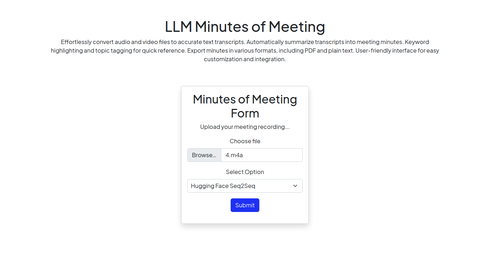
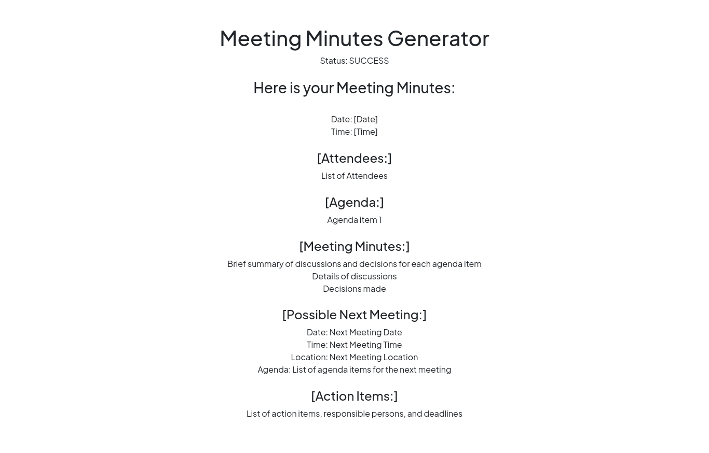
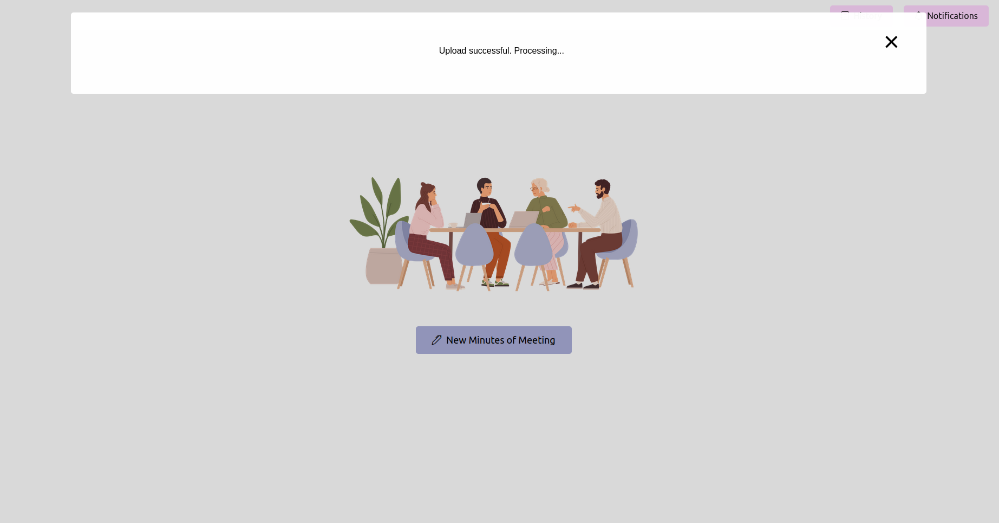
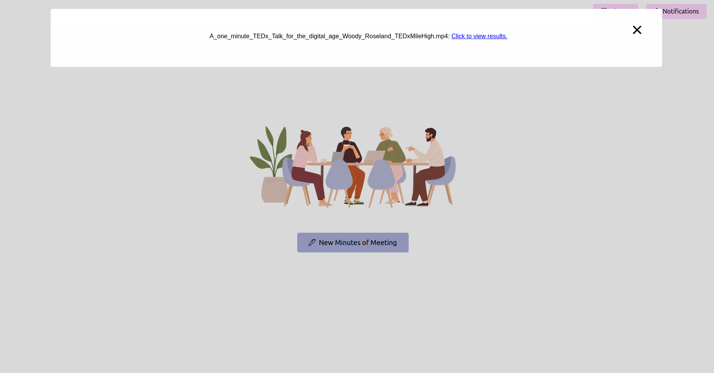
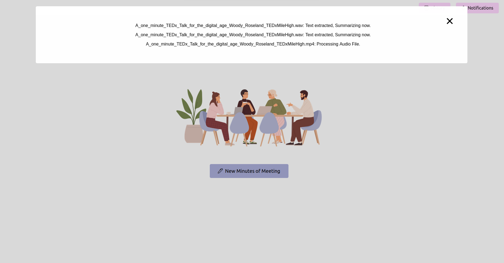
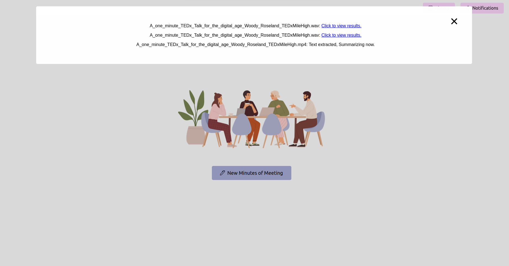

# LLM-Minutes-of-Meeting


The primary objective of this project is to showcase NLP & LLM's capability to quickly summarize long meetings and help you and your organization automate the task of delegating Minutes of Meeting(MoM) emails. It uses a high level 2 step approach where step 1 corresponds to convert any audio/video file into a text piece. Step 2 corresponds to using text produce by step 1 and generate Minutes of meeting. These minutes of meeting will be editable piece of text. Once you finalize the MoM, you can use it further as per your requirement. 

However, long term objective for this repository is also to develop a real time python web-application which can attend meetings for you and also provide you MoM at the end of the meeting. Taking baby steps and trying to get to long-term by starting a short term objective.

------

**<u>For your Information</u>: I am working on training a custom LLM. Please be patient while I train it. I will add training & inference code once completed. Do :star: This repository if you need to know latest updates.** :smile: **Appreciate your time.** 

------


## Features: :sparkles: 

- Effortlessly convert audio and video files to accurate text transcripts: These can also be used to summarize, generate action items, understanding work-flows, and resource planning. 

- Keyword highlighting and topic tagging for quick reference: Extracting topics and finding relevant contents to skip through meetings and listen to only specific topics which is of your interest.

- Export minutes in various formats, including PDF and plain text: Allows you to export meeting transcripts, summaries, topic & keywords, action items, etc into documents which can be utilized in project planning and management frameworks. Also eliminates your need to manually write and generate templates.

- User-friendly interface for easy customization and integration: Easy to tweak which ever open-source or closed source model you want to choose. 


## Approach and Implementation: :bulb: 

### Overview

The core functionality revolves around processing meeting recordings submitted via the home page of the web application. Once a recording is submitted, a background task is initiated using Celery, which performs two primary operations: speech-to-text conversion and generating minutes of the meeting from the converted text.

### Key Components

1. **Frontend Interface**: A user-friendly home page that allows users to upload their meeting recordings in various formats (audio or video).
2. **Celery Task Queue**: Once a file is uploaded, a Celery task is triggered to handle the processing asynchronously, ensuring the web application remains responsive.
3. **Speech-to-Text Conversion**: The first step in the Celery task is converting the speech in the recording to text. This process utilizes advanced speech recognition algorithms to accurately transcribe spoken words.
4. **Text Processing with LLM**: After transcription, the text is processed using a large language model (LLM) to distill the content into minutes. This involves summarizing, identifying key points, and organizing the information in a structured format.
5. **Result Delivery**: The final minutes of the meeting are sent back to the frontend, where they are displayed for the user to review, edit, and save.

Data Preparation for LLM Loop:


## Technical Stack: :computer: 

- **Backend**: Python, Flask
- **Asynchronous Task Queue**: Celery
- **Speech-to-Text**: Wav2vec2, Whisper, Faster-Whisper
- **LLM for Text Processing**: LLM
- **Frontend**: HTML, CSS, JavaScript


## Use Cases and Applications: :white_check_mark: 

1. **Corporate Meetings**: Enhances productivity by providing quick and accurate minutes for various corporate gatherings, board meetings, and team discussions.
2. **Educational Institutions**: Useful for lecturers and students to transcribe and summarize lectures, seminars, and group discussions.
3. **Legal and Medical Fields**: Helps in accurately documenting legal proceedings, interviews, and patient consultations.
4. **Accessibility**: Assists individuals with disabilities, especially those who have difficulties in note-taking, by providing an automated way to capture and summarize spoken content.
5. **Event Coverage**: Useful for journalists and event organizers to transcribe speeches, presentations, and panel discussions, aiding in report creation and event documentation.


## Future Scope and Enhancements: :crystal_ball: 

- Integration with video conferencing tools for direct recording capture.
- Multi-language support for speech-to-text conversion.
- Enhanced summarization features tailored to specific meeting types (e.g., technical, business strategy).
- Real-time transcription and summarization capabilities.
- User customization options for formatting the minutes.


## Sample Screenshots of Application:

1. Home Screen.



2. New Minutes of Meeting Dialogue


3. Upload Video/Audio File.



4. Notification Center - Started Processing



5. Notification Center - In Prgress Real Time Updates


6. Notification Center - Completed Processing



7. Final Minutes of Meeting Page


8. Notification Center - Multiple File Status


9. Notification Center - Multiple File Status



10. Notification Center - Multiple File Status




## Running the Tool Locally: :slot_machine: 

### Prerequisites

Before proceeding, ensure you have the following installed:

- Python (version 3.6 or higher recommended)
- Pip (Python package manager)
- Git (for cloning the repository)
- A suitable text editor or IDE (like Visual Studio Code, PyCharm, etc.)
- [Optional but recommended] A virtual environment tool like `virtualenv`

### Installation and Setup:

1. **Clone the GitHub Repository**

   Open your terminal or command prompt and navigate to the directory where you want to clone the repository. Then run:

   ```bash
   git clone https://github.com/inboxpraveen/LLM-Minutes-of-Meeting
   cd LLM-Minutes-of-Meeting
   ```

2. **Install Requirements**

   It's a good practice to create a virtual environment before installing dependencies to avoid potential conflicts with other Python projects. If you're using `virtualenv`, you can set up a new environment as follows:

   ```bash
   virtualenv venv
   source venv/bin/activate  # For Unix or macOS
   venv\Scripts\activate  # For Windows
   
   # Install the required packages using:
   pip install -r requirements.txt
   ```

3. **Run Application and Parallel Run Celery Task**

   First, start the Flask application:

   ```bash
   export FLASK_APP=app.py  # For Unix or macOS
   set FLASK_APP=app.py  # For Windows
   flask run
   ```

   In a new terminal window (ensure your virtual environment is activated here as well), start the Celery worker:

   ```bash
   celery -A app.celery worker --loglevel=info -f celery.logs
   ```

4. **Upload Recording to Form**

   Open your web browser and navigate to the Flask application's URL (usually `http://127.0.0.1:5000`). Use the interface to upload your meeting recording.

5. **Get Latest Status and Wait for It to Complete**

   After uploading the recording, you can check the status of the processing. This could be implemented as a status page or a progress bar in your application. Wait until the processing is complete.

6. **See the Final Processed Minutes of Meeting (MoM)**

   Once the processing is complete, the application should display the final minutes of the meeting. You can view, edit (if the feature is available), and save the MoM for your reference.


## Troubleshooting: :bug: 

- Ensure all environment variables required by the application and Celery are correctly set.
- Check for any error messages in the Flask and Celery terminal outputs.
- Make sure the versions of Python and the packages in `requirements.txt` are compatible.


## Phase 2 - Real-Time Transcriptions: :next_track_button: 
In Phase 2 of our project, we plan to enable real-time meeting transcription. Join us in shaping the future of efficient and collaborative meetings!


## Stay Updated: 

🔍 Follow me for updates on Phase 2 development and other enhancements to make your meetings even more productive.


## Contributions Welcome: 

👩‍💻 Encouraging contributions from the community to make this tool a game-changer for meetings everywhere. Contribute your ideas and expertise to help us achieve real-time transcription!
